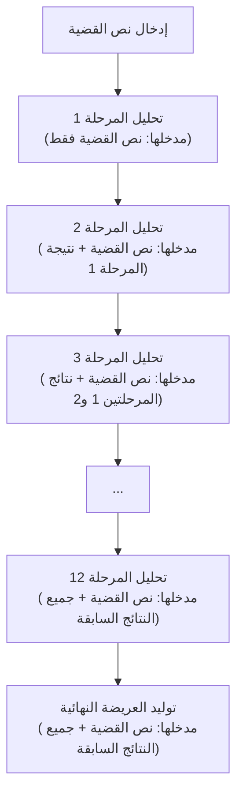

# خارطة سير التحليل التراكمي (Chained Legal Reasoning)

## الوصف

- كل مرحلة تحليلية تعتمد على نص القضية الأصلي بالإضافة إلى مخرجات جميع المراحل السابقة.
- المرحلة الأخيرة تولد العريضة القانونية النهائية بناءً على كامل التحليل السابق.

## المخطط المرئي

## الملاحظات

- كل مرحلة تحليلية يجب أن تأخذ في الاعتبار مخرجات جميع المراحل السابقة.
- يجب احترام حدود الطول الخاصة بـ Gemini Flash (حوالي 8000 tokens).
- المرحلة الأخيرة (العريضة النهائية) تجمع كل التحليلات السابقة وتنتج:
  - مسودة العريضة القانونية.
  - الأسناد القانونية.
  - خلاصة استراتيجية للفوز بالقضية. 